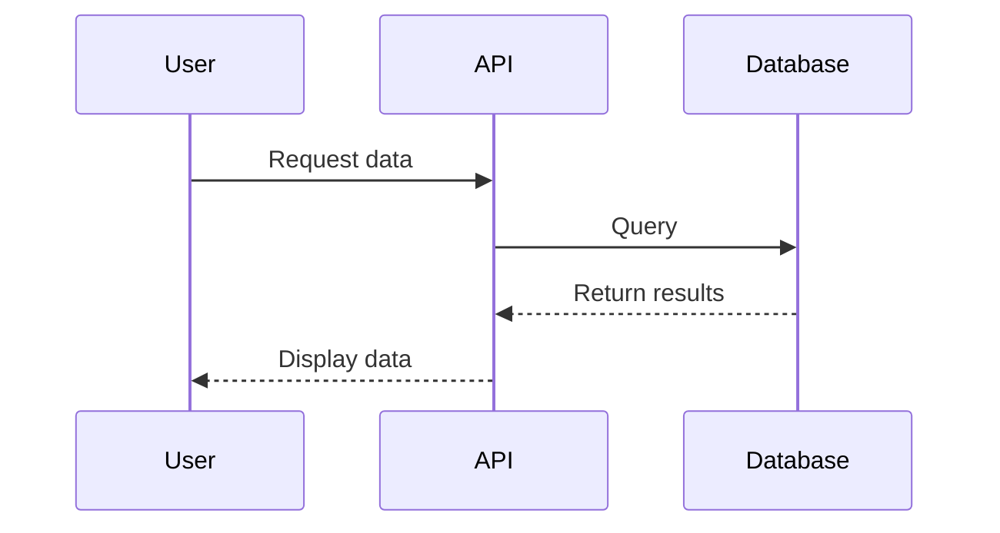
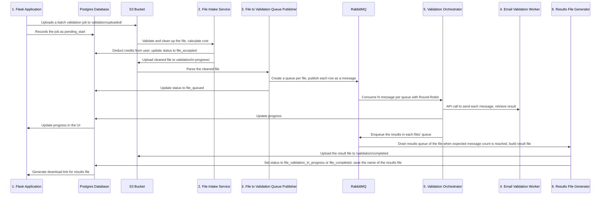
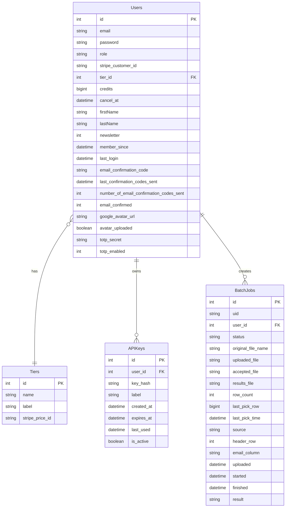
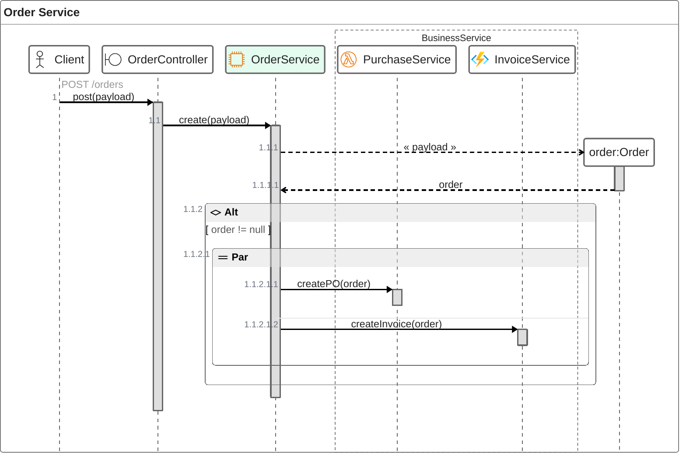

<p align="center">
  
</p>

<h1 align="center">MailListShield - Event-Driven Email Validation SaaS</h1>

<p align="center">
  A production-grade email validation platform built with microservices architecture
</p>

# Mermaid Test

My notes on using the [Mermaid Diagrams](https://mermaid.js.org/).

- [mermaid.live](https://mermaid.live/) with examples
- [mermaidchart.com/play](https://www.mermaidchart.com/play)
- [Mermaid Docs](https://mermaid.js.org/intro/)
- [Example Sphinx documentation](https://sphinxcontrib-mermaid-demo.readthedocs.io/en/latest/)

## Use Cases

- Diagrams within markdown for readme files,
  - To preview the diagrams within markdown files in VSCode, use the [`bierner.markdown-mermaid`](https://marketplace.visualstudio.com/items/?itemName=bierner.markdown-mermaid) extension.
- Diagrams within Sphinx documentation
  - For building the docs with CI:
    - Install it in the CI environment:

        ```bash
        pip install sphinxcontrib-mermaid
        ```

    - Add the sphinx extension

        ```python
        extensions = [
            # ...
            'sphinxcontrib.mermaid',
        ]
        ```

    - Also install it in the devcontainer, if applicable.

    - Then you can insert Mermaid diagrams in rst files like this:

        ```rst
        .. mermaid::

            sequenceDiagram
                participant User
                participant API
                participant Database
                User->>API: Request data
                API->>Database: Query
                Database-->>API: Return results
                API-->>User: Display data
        ```

## Examples

Example for demonstrating communication between services:



Example of a sequence diagrams I can use for microservices:



### Database Model




zenuml:

